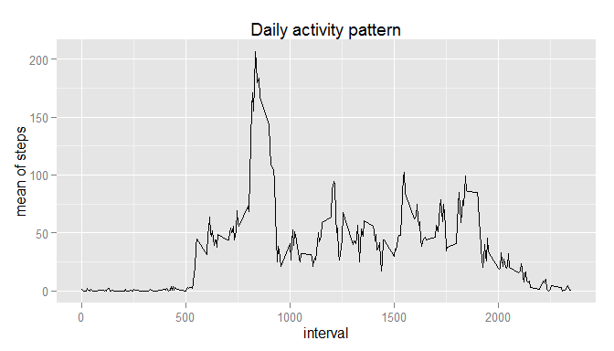

Peer Assessment 1 Report
=================================================
 
## Loading and preprocessing the data

1. Load the data


```r
activity <- read.csv2(unz("activity.zip", "activity.csv"), sep = ",")
```

## What is mean total number of steps taken per day?

1. Histogram of the total number of steps taken each day

```r
stepsEachDay <- tapply(activity$steps, activity$date, sum)
library(ggplot2)
qplot(stepsEachDay, xlab = "Total steps", ylab = "Days count", 
      main = "Histogram of steps per day", binwidth = 1000)
```

 

2. Compute the mean and median of total steps taken per day

```r
meanstepsEachDay = mean(stepsEachDay, na.rm = T)
medianstepsEachDay = median(stepsEachDay, na.rm = T)
```

* The mean and median of the total steps taken per day are 10766 and 
10765 respectively.

## What is the average daily activity pattern?

1. Time series plot of the 5-minute interval (x-axis) and the average number of steps taken, averaged across all days (y-axis)

```r
stepsPerInterval <- aggregate(steps ~ interval, activity, mean, na.rm = T)
colnames(stepsPerInterval) <- c("interval","steps.mean")

qplot(interval, steps.mean, data = stepsPerInterval, geom = "line", 
      main = "Daily activity pattern", ylab = "mean of steps")
```

 

2. Search the interval with the maximum number of steps

```r
maxInterval <- stepsPerInterval[which.max(stepsPerInterval[, 2]), 1]
```
 * The interval 835 has the maximum number of steps. 


## Imputing missing values

1. Compute the total missing values on the dataset.


```r
isNA <- is.na(activity$steps)
totalNAs <- sum(isNA)
```

 * There is a total of 2304 missing values on the dataset.

2. To address this issue, the mean value calculated for each time interval across 
all days (discarding NA values) are used to fill the missing values.

3. The dataset activity.noNA is created using the methodology described above 
(item 2).


```r
activity.noNA <- activity
activity.noNA[isNA, "steps"] <- stepsPerInterval[match(activity[isNA, "interval"], 
        stepsPerInterval[,1]), 2]
```

4. The new histogram is presented below. As the missing data refers to 8 full days, and not to spread time intervals, the histogram presents more occurrences on the mean value of the distribution (i.e. center of mass of the distribution). Mean and median are computed right after.


```r
stepsEachDay.noNA <- tapply(activity.noNA$steps, activity.noNA$date, sum)

qplot(stepsEachDay.noNA, xlab = "Total steps", ylab = "Days count", 
      main = "Histogram of steps per day replacing missing values", binwidth = 1000)
```

 

```r
meanstepsEachDay.noNA = mean(stepsEachDay.noNA)
medianstepsEachDay.noNA = median(stepsEachDay.noNA)
```

 * The new mean value is 10766,  which is the same as before.
This happens because the 8 missing days were filled with information equivalent to the mean of the remaining 53 days, thus the general mean is kept constant. The median is 10766, which is slightly higher than before. This happens because the 8 days that were included fell in the middle of the distribution, and the median was given by one of these. 


## Are there differences in activity patterns between weekdays and weekends?

1. New factor to sort "weekday" and "weekend" activities is added.

```r
activity.noNA$weekdays <- weekdays(as.Date(activity$date))
weekend <- is.element(activity.noNA$weekdays, c("Saturday", "Sunday"))
activity.noNA[weekend, "weekdays"] <- "weekend"
activity.noNA[!weekend, "weekdays"] <- "weekday"
activity.noNA$weekdays <- as.factor(activity.noNA$weekdays)
```

2. Panel plot with the time series plot of the "weekday" and "weekend" levels of weekdays factor

```r
perInterval.noNA <- aggregate(steps ~ interval + weekdays, activity.noNA,  mean)

colnames(perInterval.noNA) <- c("interval", "weekdays", "steps.mean")
qplot(interval, steps.mean, facets = weekdays~., data = perInterval.noNA, 
        geom = "line", xlab = "Interval", ylab = "Number of steps")
```

 
 
 * Most notably, physical activity tends to start later during the weekends. Moreover, activity is spread more evenly during the weekends, while during the weekdays the peak between 8 and 9 AM is very prominent.
